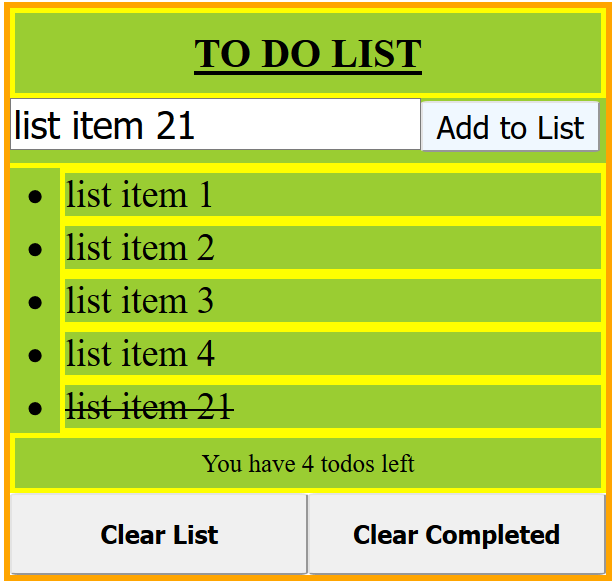

# ✅ Week05 Bootcamp2019 Project: Todo List

### Goal: Build a Simple Todo List
Hosted here: https://practical-mcnulty-32b839.netlify.com/
### How I did it

- Used HTML, CSS, and JS 
- Created an input box as well as a submit button
- Upon clicking the submit button, the input would be appended to an unordered list that was initially empty
- Added an event listener to the ul which would work so that any element within it that's clicked will get a line through it
- Added two buttons which had click listeners, each has a different function. One hides the entire list (display: none) and the other only hides those that have a line-through property
- After each action (adding to list, clicking on list items that are done, clearing, etc) a function runs that checks how many list items there are that also haven't been striked through or had their displays hidden
  

